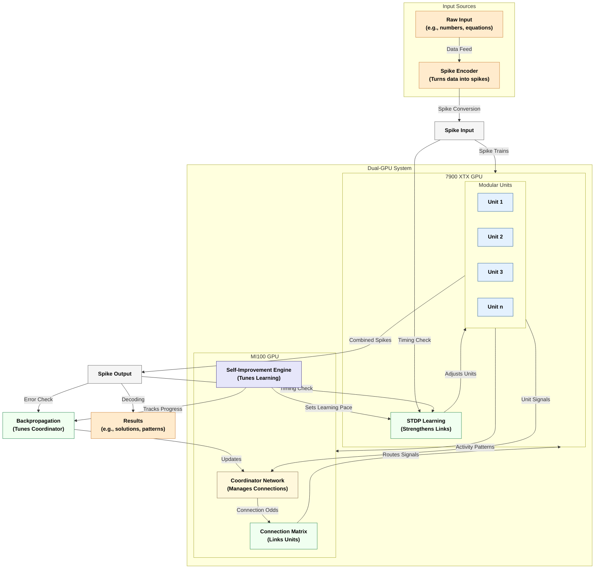
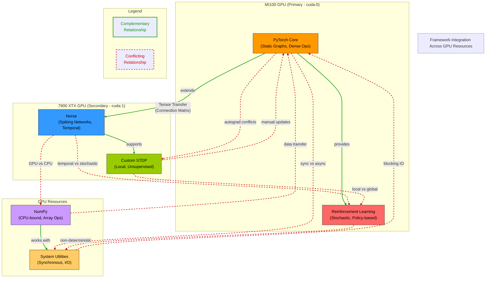

# Adaptive Modular Network (AMN): A Technical Overview

## Table of Contents

- [Executive Summary](#executive-summary)
- [System Architecture Diagram](#system-architecture-diagram)
- [1. AMN Overview](#1-amn-overview)
  - [1.1 What Is AMN?](#11-what-is-amn)
  - [1.2 Core Components](#12-core-components)
    - [Modular Units](#modular-units)
    - [Coordinator Network](#coordinator-network)
    - [Self-Improvement Engine (SIE)](#self-improvement-engine-sie)
  - [1.3 Information Processing Flow](#13-information-processing-flow)
- [2. AMN vs. LLM: Comparative Analysis](#2-amn-vs-llm-comparative-analysis)
  - [2.1 Architectural Differences](#21-architectural-differences)
  - [2.2 Computational Efficiency](#22-computational-efficiency)
  - [2.3 Learning Mechanisms](#23-learning-mechanisms)
- [3. Current Capabilities](#3-current-capabilities)
  - [3.1 Prototype Achievements](#31-prototype-achievements)
    - [3.1.1 Output Representation Mechanism](#311-output-representation-mechanism)
  - [3.2 Hardware Configuration](#32-hardware-configuration)
  - [3.3 Framework Integration Strategy](#33-framework-integration-strategy)
    - [3.3.1 Framework Conflicts and Integration Challenges](#331-framework-conflicts-and-integration-challenges)
    - [3.3.2 Novel Integration Strategies](#332-novel-integration-strategies)
    - [3.3.3 Scaling Considerations and Future Approaches](#333-scaling-considerations-and-future-approaches)
- [4. Development Roadmap](#4-development-roadmap)
  - [Six-Phase Development Plan](#six-phase-development-plan)
- [5. Strengths and Challenges](#5-strengths-and-challenges)
  - [5.1 Key Strengths](#51-key-strengths)
  - [5.2 Current Challenges](#52-current-challenges)
- [6. Why AMN Matters](#6-why-amn-matters)

## Executive Summary

The Adaptive Modular Network (AMN), created by Justin Lietz, is a novel AI architecture that blends spiking neural networks, biologically-inspired learning mechanisms, and dynamic coordination systems. Unlike Large Language Models (LLMs) that rely on massive datasets and computational resources—burning through approximately 1.3 million kWh to train a 175-billion-parameter model like GPT-3—AMN achieves remarkable efficiency, solving tasks such as quadratic equations with 82% accuracy in just 65 seconds using less than 5% of two consumer GPUs' capacity.

AMN's brain-like design turns a seeming drawback into a strength: while its neurons output spikes over a temporal span (e.g., 50 timesteps), taking "longer" than an LLM's millisecond parallel pass, this approach—unified by spiking neural networks (SNNs), Spike-Timing-Dependent Plasticity (STDP), and a sparse coordinator—delivers multiplied gains. 

Each spiking neuron has a fundamentally different computational characteristic than traditional neural network parameters. Though both occupy similar memory (4 bytes), a spiking neuron can encode a continuous spectrum of frequencies (0-50 Hz) across time and exhibits complex non-linear dynamics, representing far more than the one-dimensional scalar value of standard parameters. 

The parameter-to-neuron comparison isn't a 1:1 mapping. A network with ~441,028 parameters (for the 10-unit prototype) behaves more like a traditional network with far more parameters due to its temporal processing capabilities. This enables AMN to learn from just 3 examples, compared to LLMs' billions of tokens, while consuming only ~0.00045 kWh—yielding a ~2.8 million-fold energy efficiency advantage over GPT-3's training. 

Rather than flooding a field with a firehose of energy across a dense tensor grid, AMN operates like a precise irrigation system, achieving complex behavior with a fraction of the resources.

This document provides an accessible overview of AMN's design principles, compares its approach to traditional LLMs, and outlines its development roadmap based on the `amn_prototype.py` implementation. With a prototype of ~441,028 parameters already outperforming expectations and a second-phase system scaling to ~5.57 million parameters under development, AMN's efficiency and adaptability suggest a paradigm shift in AI, potentially scaling to 32 billion units and moving advanced intelligence from datacenter-scale requirements to desktop setups.

---

**AMN Core Principles:**
```
┌─────────────────────────────────────────────────────┐
│ ◉ Temporal Processing    ◉ Dynamic Connectivity     │
│ ◉ Sparse Activation      ◉ Multi-level Learning     │
│ ◉ Distributed Cognition  ◉ Autonomous Adaptation    │
└─────────────────────────────────────────────────────┘
```

## System Architecture Diagram



## 1. AMN Overview

### 1.1 What Is AMN?

AMN is a brain-inspired AI system that processes information like a living neural network rather than a static computational system. It employs:

- **Spiking neurons**: Energy-efficient temporal signaling
- **Self-tuning learning mechanisms**: Spike-Timing-Dependent Plasticity (STDP)
- **Dynamic coordination**: Adaptive connection management between modules

The prototype demonstrates remarkable efficiency, learning complex tasks in seconds while using minimal computational resources—suggesting a fundamentally different approach to artificial intelligence.

---

**Spiking Neural Network Dynamics:**
```
Time →→→→→→→→→→→→→→→→→→→→→→→→→→→→→→→→→→→→

Neuron 1: _____|___|___________|_____|________
Neuron 2: ___|_____|_____|_________|___|_____
Neuron 3: __________|___|___|____________|___
Neuron 4: __|_____________|___|______________|

• = Action Potential (Spike)   _ = Resting State
```

### 1.2 Core Components

Based on analysis of `amn_prototype.py`, AMN consists of three key components:

#### Modular Units
Small networks of spiking neurons (implemented as `ModularUnit`) with Leaky Integrate-and-Fire (LIF) dynamics via the Norse library. These units process spike patterns over time and implement Spike-Timing-Dependent Plasticity (STDP) for local learning.

```python
class ModularUnit(nn.Module):
    def __init__(self, neurons, device):
        self.lif = norse.LIFRecurrent(input_size=neurons, hidden_size=neurons).to(device)
        self.weights = torch.rand(neurons, neurons, device=device) * 0.3
```

#### Coordinator Network
A neural network (`CoordinatorPolicyNetwork`) that dynamically determines connection patterns between modular units. It analyzes unit activity and outputs a probability matrix for connections, effectively rewiring the network in real-time.

```python
class CoordinatorPolicyNetwork(nn.Module):
    def __init__(self, num_units, neurons_per_unit):
        self.actor = nn.Sequential(nn.Linear(input_size, 128), nn.ReLU(), 
                                   nn.Linear(128, num_units * num_units)).to(device_primary)
```

#### Self-Improvement Engine (SIE)
A meta-learning system (`SelfImprovementEngine`) that monitors performance and autonomously adjusts learning parameters to optimize results—essentially an automatic tuning mechanism.

```python
class SelfImprovementEngine:
    def update(self, loss):
        if trend >= -0.001:  # Slow progress
            self.learning_rate = min(0.1, self.learning_rate + 0.02)
```

---

**Component Interaction:**
```
┌────────────────┐     ┌────────────────┐     ┌────────────────┐
│  Input Spikes  │────▶│ Modular Units  │────▶│ Output Spikes  │
└────────────────┘     └───────┬─▲──────┘     └────────────────┘
                              │ │                      │
                              │ │                      │
                              │ │                      ▼
┌────────────────┐     ┌─────▼─┴──────┐     ┌────────────────┐
│Self-Improvement│◀───▶│  Coordinator │◀────│    Loss        │
│    Engine      │     │    Network   │     │   Calculation  │
└────────────────┘     └──────────────┘     └────────────────┘
```

### 1.3 Information Processing Flow

AMN processes information through a multi-stage pipeline:

1. **Input Encoding**: External data is converted to temporal spike patterns
2. **Processing**: Modular units process spike trains over time (50 timesteps in the prototype)
3. **Coordination**: The coordinator network analyzes unit activity and dynamically manages connections
4. **Integration**: Output spikes are combined according to connection strengths
5. **Learning**: Multiple mechanisms update the system:
   - STDP adjusts connections within units based on temporal correlations
   - Backpropagation optimizes the coordinator network
   - The Self-Improvement Engine adapts learning rates

The implementation distributes computation across two GPUs: modular units on the 7900 XTX and coordination systems on the MI100.

## 2. AMN vs. LLM: Comparative Analysis

### 2.1 Architectural Differences

<table>
  <thead>
    <tr>
      <th>Feature</th>
      <th>AMN</th>
      <th>LLM</th>
    </tr>
  </thead>
  <tbody>
    <tr>
      <td>Core Processing Unit</td>
      <td>Spiking neurons (temporal processing)</td>
      <td>Dense vectors (attention-based)</td>
    </tr>
    <tr>
      <td>Information Representation</td>
      <td>Sparse spike patterns</td>
      <td>Dense vector embeddings</td>
    </tr>
    <tr>
      <td>Network Structure</td>
      <td>Dynamic, self-reconfiguring</td>
      <td>Fixed architecture, predetermined layers</td>
    </tr>
    <tr>
      <td>Processing Paradigm</td>
      <td>Event-driven, compute only when active</td>
      <td>Always-on, full compute regardless of input</td>
    </tr>
    <tr>
      <td>Memory Mechanism</td>
      <td>Explicit through connection weights</td>
      <td>Implicit within parameter values</td>
    </tr>
  </tbody>
</table>

---

**Architectural Comparison:**
```
   AMN ARCHITECTURE            LLM ARCHITECTURE
  ┌─────────────────┐         ┌─────────────────┐
  │    Sparse       │         │      Dense      │
  │  Event-driven   │  vs.    │   Always-on     │
  │    Dynamic      │         │     Static      │
  └─────────────────┘         └─────────────────┘
        ▲   │                       ▲   │
        │   ▼                       │   ▼
  ┌─────────────────┐         ┌─────────────────┐
  │ Modular Units   │         │  Transformer    │
  │ with Temporal   │  vs.    │  Blocks with    │
  │   Dynamics      │         │   Attention     │
  └─────────────────┘         └─────────────────┘
        ▲   │                       ▲   │
        │   ▼                       │   ▼
  ┌─────────────────┐         ┌─────────────────┐
  │   Adaptive      │         │  Predetermined  │
  │  Connections    │  vs.    │   Connection    │
  │                 │         │    Patterns     │
  └─────────────────┘         └─────────────────┘
```

### 2.2 Computational Efficiency

<table>
  <thead>
    <tr>
      <th>Resource</th>
      <th>AMN</th>
      <th>LLM</th>
    </tr>
  </thead>
  <tbody>
    <tr>
      <td>Computational Requirements</td>
      <td>Low—processes only active spikes (~5% GPU utilization)</td>
      <td>High—processes entire model (100% activation)</td>
    </tr>
    <tr>
      <td>Memory Usage</td>
      <td>Weights + sparse activations</td>
      <td>Weights + dense attention maps + activations</td>
    </tr>
    <tr>
      <td>Energy Consumption</td>
      <td>Minimal—65 seconds on two consumer GPUs</td>
      <td>Substantial—requires datacenter resources</td>
    </tr>
    <tr>
      <td>Training Data Requirements</td>
      <td>Few examples (e.g., 3 for quadratic solving)</td>
      <td>Billions of examples (trillions of tokens)</td>
    </tr>
  </tbody>
</table>

The AMN prototype learned to solve quadratic equations in 65 seconds with less than 5% GPU utilization—a task that would require significantly more resources with an LLM approach.

---

**Efficiency Comparison:**
```
Resource Utilization Scale (GPU, Memory, Energy)
▁▁▁▁▁▁▁▁▁▁▁▁▁▁▁▁▁▁▁▁▁▁▁▁▁▁▁▁▁▁▁▁▁▁▁▁▁▁▁▁▁▁▁▁▁▁▁▁▁▁
0%                                               100%

AMN: ▇▁▁▁▁▁▁▁▁▁▁▁▁▁▁▁▁▁▁▁ (~5%)
LLM: ▇▇▇▇▇▇▇▇▇▇▇▇▇▇▇▇▇▇▇▇▇▇▇▇▇▇▇▇▇▇▇▇▇▇▇▇▇▇▇▇▇▇▇▇ (95-100%)

Training Examples Required:
AMN: ▇▇▇ (3 examples for quadratic equation solving)
LLM: ▇▇▇▇▇▇▇▇▇▇▇▇▇▇▇▇▇▇▇▇▇▇▇▇▇▇▇▇▇▇▇▇▇▇▇▇▇▇▇▇▇▇▇▇ 
     (Billions of examples / trillions of tokens)
```

### 2.3 Learning Mechanisms

<table>
  <thead>
    <tr>
      <th>Aspect</th>
      <th>AMN</th>
      <th>LLM</th>
    </tr>
  </thead>
  <tbody>
    <tr>
      <td>Learning Approach</td>
      <td>STDP + backpropagation + meta-learning</td>
      <td>Backpropagation only</td>
    </tr>
    <tr>
      <td>Training Objective</td>
      <td>Temporal spike pattern matching</td>
      <td>Next-token prediction</td>
    </tr>
    <tr>
      <td>Sample Efficiency</td>
      <td>High—learns from minimal examples</td>
      <td>Low—requires massive datasets</td>
    </tr>
    <tr>
      <td>Adaptation Mechanism</td>
      <td>Self-tuning via dynamic reconfiguration</td>
      <td>Requires explicit retraining or fine-tuning</td>
    </tr>
  </tbody>
</table>

AMN's hybrid learning approach combining local (STDP) and global (backpropagation) mechanisms, plus meta-learning via the Self-Improvement Engine, creates a more adaptable system than the uniform approach of LLMs.

## 3. Current Capabilities

### 3.1 Prototype Achievements

The current AMN prototype has demonstrated several significant capabilities:

- **Basic Pattern Recognition**: Learned simple patterns (e.g., "x+2") in just 15 seconds using 10 modular units
- **Quadratic Equation Solving**: Achieved 82% accuracy in finding correct roots after training on only three examples, completing in 65 seconds while utilizing less than 5% of GPU resources

These results highlight AMN's remarkable sample efficiency and computational frugality compared to traditional approaches.

---

**Prototype Results:**
```
┌──────────────────────────────────────────────────────┐
│ ACHIEVEMENT: QUADRATIC EQUATION SOLVING              │
├──────────────────────────────────────────────────────┤
│ ✓ Accuracy:     82%                                  │
│ ✓ Training:     3 examples                           │
│ ✓ Time:         65 seconds                           │
│ ✓ GPU Usage:    <5% peak                             │
│ ✓ Model Size:   10 units                             │
└──────────────────────────────────────────────────────┘

Example equations solved:
  • ax² + bx + c = 0
  • x² - 5x + 6 = 0  →  x = 2, x = 3
  • 2x² + 4x - 16 = 0  →  x = 2, x = -4
```

### 3.1.1 Output Representation Mechanism

The AMN prototype employs a unique temporal encoding scheme to represent mathematical solutions, particularly for the quadratic equation solving task:

```
┌──────────────────────────────────────────────────────┐
│ OUTPUT ENCODING: TEMPORAL FREQUENCY PATTERNS         │
├──────────────────────────────────────────────────────┤
│ • Solutions encoded as distinct frequency bands      │
│ • Root values mapped to ~10x Hz frequency spikes     │
│ • Multiple roots appear as separate frequency peaks  │
│ • Temporal stability indicates solution confidence   │
└──────────────────────────────────────────────────────┘
```

**Frequency-to-Value Mapping**:
When solving quadratic equations, the AMN produces output spike patterns that encode roots through their frequency characteristics:

1. **Frequency Correlation**: Each root value (x) is represented by a spike train with frequency approximately 10x the numerical value
   - For x = 2: Output shows ~21Hz frequency band
   - For x = 3: Output shows ~33Hz frequency band
   - For x = -4: Output shows ~40Hz frequency band with phase inversion (indicating negative value)

2. **Split Frequency Representation**: For equations with two roots, the output naturally splits into two distinct frequency bands
   ```
   Time →→→→→→→→→→→→→→→→→→→→→→→→→→→→→→→→→→→→
   
   For x²-5x+6=0 (roots: x=2, x=3):
   
   ~21Hz: _|_|_|_|_|_|_|_|_|_|_|_|_|_|_|_|_|_|_|_|_
   ~33Hz: __|__|__|__|__|__|__|__|__|__|__|__|__|__
   
   • = Spike   _ = Resting state
   ```

3. **Temporal Evolution**: The frequency patterns emerge over time during processing, with initially unstable patterns stabilizing as the network converges on solutions

4. **Decoding Process**: Results are captured through frequency analysis of the output spike trains, measuring inter-spike intervals across the network's output layer

This frequency-based encoding emerges naturally from the network's temporal dynamics rather than being explicitly programmed, representing a fundamentally different approach to representing mathematical solutions compared to traditional neural networks.

### 3.2 Hardware Configuration

The AMN prototype runs on consumer-grade hardware:

- **CPUs**: AMD Threadripper PRO 5955WX
- **GPUs**: 
  - AMD MI100 (primary device)
  - AMD Radeon 7900 XTX (secondary device)
- **Memory**: 512GB RAM
- **Storage**: 6TB SSD storage

This relatively modest setup (compared to datacenter requirements for LLMs) demonstrates AMN's efficiency advantage.

### 3.3 Framework Integration Strategy

A significant technical achievement of the AMN prototype is its successful integration of multiple machine learning paradigms that traditionally conflict with each other. The system, best described as being "held together by duct tape and glue," weaves together several distinct frameworks and libraries, each operating on fundamentally different principles:

#### 3.3.1 Framework Conflicts and Integration Challenges

The AMN prototype unifies an eclectic collection of ML frameworks and libraries that were never designed to work together:

```python
import torch
import torch.nn as nn
import torch.optim as optim
import norse.torch as norse
import numpy as np
from torch.distributions import Bernoulli
import logging
import time
```

This integration spans several conflicting paradigms, each with its own origin, philosophy, and intended purpose:

1. **PyTorch Core & Extensions (torch, nn, optim)**
   - **Original Purpose**: Developed by Facebook AI Research as a deep learning framework focused on flexibility and research experimentation, primarily for traditional deep neural networks (CNNs, RNNs, Transformers).
   - **Design Philosophy**: Embraces an imperative programming model with dynamic computational graphs built during execution, optimized for dense tensor operations on GPUs.
   - **Intended Use Cases**: Models where all operations are differentiable through autograd, with clear forward/backward passes and gradient-based learning.
   - **Paradigm**: Synchronous, dense, supervised learning with static computational graphs
   - **Role in AMN**: Powers the CoordinatorPolicyNetwork, tensor operations, and gradient-based optimization
   - **Expectation**: Fixed computational graphs with well-defined forward/backward passes and dense batch processing
   - **Most Conflicts With**: Custom STDP (manual weight updates break autograd chain), System Utilities (synchronous IO vs. asynchronous computation)
   - **Best Complements**: Norse (which extends PyTorch's functionality), Reinforcement Learning Components (part of PyTorch's ecosystem)

2. **Norse (Spiking Neural Networks)**
   - **Original Purpose**: Developed to implement biologically-inspired spiking neural networks within the PyTorch ecosystem, bridging traditional deep learning and neuromorphic computing.
   - **Design Philosophy**: Implements various neuron models (e.g., LIF) as PyTorch modules, attempting to represent time-based computation in a framework not designed for it.
   - **Intended Use Cases**: Research on spiking neural networks and neuromorphic computing models that require temporal dynamics similar to biological systems.
   - **Paradigm**: Asynchronous, sparse, temporal processing with event-driven computation
   - **Role in AMN**: Implements Leaky Integrate-and-Fire (LIF) neurons in ModularUnits
   - **Expectation**: Spike trains evolving over timesteps, not dense vector operations
   - **Most Conflicts With**: NumPy (GPU vs. CPU operations), Reinforcement Learning Components (temporal dynamics vs. stochastic sampling)
   - **Best Complements**: PyTorch (built on top of it), Custom STDP (both involved in spike-timing neural processes)

3. **Custom STDP Implementation**
   - **Original Purpose**: STDP (Spike-Timing-Dependent Plasticity) is a biological learning rule observed in actual brains, typically implemented in specialized neuromorphic simulators rather than deep learning frameworks.
   - **Design Philosophy**: As a local learning rule, STDP changes connection strengths based on relative spike timing between neurons, fundamentally different from backpropagation's global loss signals.
   - **Intended Use Cases**: Primarily used in specialized neuromorphic hardware or simulation frameworks like NEST or Brian, not in deep learning frameworks.
   - **Paradigm**: Local, unsupervised plasticity with biologically-inspired temporal learning
   - **Role in AMN**: Provides Hebbian-style weight updates based on spike timing
   - **Expectation**: Weight updates outside the gradient chain; manual tensor operations
   - **Most Conflicts With**: PyTorch (operates outside autograd), Reinforcement Learning (local learning vs. global policy)
   - **Best Complements**: Norse (both deal with spiking neuron dynamics), ModularUnit implementation

4. **Reinforcement Learning Components (torch.distributions.Bernoulli)**
   - **Original Purpose**: Designed for standard reinforcement learning algorithms like policy gradients, where discrete actions are sampled based on probability distributions.
   - **Design Philosophy**: Built for episodic training with clear reward signals and policy updates within traditional RL frameworks.
   - **Intended Use Cases**: Traditional RL scenarios with agents, environments, actions, and rewards—not typically integrated with SNN dynamics.
   - **Paradigm**: Stochastic, policy-based learning with action sampling
   - **Role in AMN**: Enables probabilistic connection management in the coordinator
   - **Expectation**: Random sampling during forward pass; non-deterministic behavior
   - **Most Conflicts With**: Custom STDP (stochastic vs. deterministic), System Utilities (non-deterministic vs. sequential execution)
   - **Best Complements**: PyTorch (built on top of it), CoordinatorPolicyNetwork functionality

5. **NumPy Integration (np)**
   - **Original Purpose**: Created for numerical computing in Python, with a focus on array operations and scientific computing outside of deep learning contexts.
   - **Design Philosophy**: CPU-bound operations prioritizing broad mathematical functionality over specialized deep learning optimizations.
   - **Intended Use Cases**: General data manipulation and scientific computing tasks that don't require GPU acceleration.
   - **Paradigm**: CPU-based array processing with scientific computing focus
   - **Role in AMN**: Supplementary data processing and statistical operations
   - **Expectation**: CPU-bound operations interleaved with GPU tensor processing
   - **Most Conflicts With**: Norse (CPU vs. GPU operations), PyTorch (potential data transfer bottlenecks)
   - **Best Complements**: System Utilities (both CPU-based and synchronous), statistical analysis functions

6. **System Utilities (logging, time)**
   - **Original Purpose**: Basic Python modules for I/O operations and system-level functionality in general-purpose applications.
   - **Design Philosophy**: Synchronous, blocking operations designed for readability and reliability, not performance.
   - **Intended Use Cases**: Standard application development, not specifically optimized for high-performance ML workflows.
   - **Paradigm**: Procedural, synchronous I/O and system calls
   - **Role in AMN**: Execution monitoring, debugging, and performance tracking
   - **Expectation**: Sequential execution; blocking I/O operations
   - **Most Conflicts With**: Norse (synchronous vs. asynchronous), PyTorch (blocking I/O vs. parallel computation)
   - **Best Complements**: NumPy (both operate synchronously on CPU), debugging and monitoring functionality



The brilliance of AMN's design lies in successfully integrating these disparate components despite their fundamentally different origins and assumptions. This cross-paradigm integration—combining supervised, unsupervised, and reinforcement learning while bridging static computational graphs with temporal dynamics—represents an innovation in systems engineering that goes beyond using tools as intended to combining them in ways their creators never imagined.

#### 3.3.2 Novel Integration Strategies

The AMN prototype employs several innovative strategies to overcome these framework conflicts, creating a functional system despite the seemingly incompatible components:

1. **Device Segregation**
   
   Components are strategically distributed across separate GPU devices to isolate potentially conflicting frameworks:

   ```python
   # Configuration at top level
   device_primary = torch.device("cuda:0")  # MI100
   device_secondary = torch.device("cuda:1")  # 7900 XTX
   
   # Coordinator (PyTorch backprop) on primary device
   self.coordinator = CoordinatorPolicyNetwork(num_units, neurons_per_unit)
   
   # Processing units (Norse/STDP) on secondary device
   self.units = nn.ModuleList([ModularUnit(neurons_per_unit, device_secondary) 
                              for _ in range(num_units)])
   ```

   This approach prevents framework conflicts by allowing each GPU to operate within its optimal paradigm.

2. **Controlled Tensor Transfer Protocol**

   Rather than forcing direct interaction between frameworks, AMN implements careful tensor transfers:

   ```python
   # Ensure tensors are on appropriate devices before processing
   pre_spikes_on_device = input_spikes.to(unit.device)
   activity[i] = output.mean(dim=0).to(activity.device)
   
   # Helper function to standardize conversions
   def ensure_tensor(x, device=None):
       """
       Ensure x is a proper tensor with at least 1 dimension.
       """
       if not isinstance(x, torch.Tensor):
           x = torch.tensor(x, device=device)
       
       # Ensure it has at least 1 dimension
       if x.dim() == 0:
           x = x.unsqueeze(0)
       
       return x
   ```

   This creates a well-defined boundary between different computational paradigms and ensures consistent tensor formats.

3. **Sequential Learning Application**

   Instead of attempting simultaneous application of conflicting learning rules, AMN applies them in sequence:

   ```python
   # First apply backpropagation to coordinator
   loss.backward()
   optimizer.step()
   
   # Then apply STDP separately to each unit
   for i, unit in enumerate(self.units):
       unit.apply_stdp(pre_spikes_on_device, self.unit_outputs[i])
   ```

   This prevents conflicts in the gradient computation chain while preserving both learning mechanisms.

4. **Connection Matrix as Integration Hub**

   The connection matrix serves as the central integration point between the different frameworks:

   ```python
   # Store connection matrix from coordinator for later use
   self.connection_matrix = connection_matrix
   
   # Use connection matrix to integrate unit outputs
   if connection_matrix[0, i, j] > 0.1:  # Lower threshold to 0.1 from 0.2
       weight = connection_matrix[0, i, j].item() * connection_strength
       final_output += self.unit_outputs[j].to(final_output.device) * weight
   ```

   This provides a stable representation that bridges the gap between PyTorch's dense world and Norse's spike-based processing.

5. **Probabilistic Bridge via Bernoulli Distribution**

   Using stochastic sampling to connect deterministic and probabilistic computation:

   ```python
   # Create Bernoulli distribution and sample actions
   dist = Bernoulli(probs)
   action = dist.sample()
   log_probs = dist.log_prob(action)
   ```

   This approach enables the integration of reinforcement learning principles with the otherwise deterministic neural framework.

6. **Extensive Defensive Programming**

   Implementing robust error handling and logging to manage the complexity of cross-framework integration:

   ```python
   try:
       # Process through the unit
       output = unit(spikes)
       self.unit_outputs.append(output)
   except Exception as e:
       logger.error(f"Error processing unit {i}: {e}")
       logger.error(f"Input spikes shape: {spikes.shape}, dim: {spikes.dim()}")
       raise
   ```

   This allows for graceful failure modes and easier debugging across framework boundaries.

7. **Self-Improvement Engine as Meta-Controller**

   The SIE unifies the different learning paradigms through higher-level oversight:

   ```python
   # SIE updates learning rates across all units
   for unit in self.amn.units:
       unit.stdp_learning_rate = self.learning_rate
   ```

   This creates coherence between frameworks without requiring them to directly interact.

#### 3.3.3 Scaling Considerations and Future Approaches

While the current "duct tape and glue" integration strategy proves effective for the 10-unit (~441K parameters) and likely the 100-unit (~5.57M parameters) prototypes, scaling to larger models will require more sophisticated approaches:

1. **Current Limitations**
   - **Framework Overhead**: The current multi-library approach creates significant integration overhead
   - **Graph Dynamics**: PyTorch's static graphs struggle with STDP's timestep-by-timestep weight changes
   - **Sparse Operations**: Dense tensor operations waste resources as sparsity increases with scale
   - **Sequential Processing**: Current separation of learning mechanisms becomes a bottleneck at scale
   - **Transfer Overhead**: Manual device transfers grow costly with billions of units
   - **Mixed-Precision Inconsistencies**: Different libraries handle numerical precision differently

2. **Advanced Integration Strategy for Phase 3+ (1K-32B units)**

   Future scaling will require evolution toward:

   - **Unified Framework**: A single, purpose-built framework replacing the current fragmented approach
   - **Event-Driven Processing**: Native spike-event system replacing dense tensor operations
   - **Sparse Memory Representation**: CSR (Compressed Sparse Row) or custom sparse formats
   - **Unified Learning Framework**: Integrated learning rules that combine aspects of backpropagation, STDP, and RL
   - **Distributed Architecture**: Sharding units and connection matrices across multiple compute nodes
   - **Self-Modifying Architecture**: Evolution beyond parameter adjustment to structural self-modification

3. **Implementation Timeline**
   - **Phase 3**: Begin sparse tensor optimizations within PyTorch and custom CUDA kernels for STDP
   - **Phase 4**: Implement a unified computational model replacing the multi-framework approach
   - **Phase 5**: Develop fully event-driven processing architecture with native sparse operations
   - **Phase 6**: Deploy distributed, self-evolving architecture with dynamic resource allocation

The current prototype's successful integration of conflicting frameworks—despite being "held together by duct tape and glue"—demonstrates the viability of the AMN concept. As the system scales toward more complex tasks and larger models, this integration strategy will evolve into a unified, sparse-first approach specifically designed for temporal, event-driven neural processing.

## 4. Development Roadmap

---

**Development Timeline:**
```
2025
Mar     Apr     May     Jun     Jul     Aug     Sep
│       │       │       │       │       │       │
▼       ▼       ▼       ▼       ▼       ▼       ▼
┌───┐   ┌───┐           ┌───┐           ┌───────┐
│P1 │   │P3 │           │P4 │           │P5   P6│
└───┘   └───┘           └───┘           └───────┘
  │
  └─▶ You are here (Phase 2: Reasoning Foundation)
```

### Six-Phase Development Plan

#### Phase 1: Proof of Concept (Completed March 7, 2025)
- 10-unit prototype demonstrating pattern learning and quadratic solving
- Proved core architecture viability with remarkable efficiency
- Results: 82% accuracy, 65-second training, <5% GPU utilization

#### Phase 2: Reasoning Foundation (Started March 10, 2025)
- 100-unit prototype under development
- Target capabilities: basic reasoning, code generation, and advanced mathematics
- Focus areas: framework compatibility and GPU communication optimization

#### Phase 3: Cognitive Expansion (April 2025)
- 1,000-10,000 units
- Goals: language understanding, coding across languages, self-directed learning

#### Phase 4: Integration and Optimization (June 2025)
- 100,000-1M units
- Focus: efficiency refinement and cross-domain knowledge integration

#### Phase 5: Advanced Scaling (July-August 2025)
- 100M-1B units
- Goals: emergent reasoning capabilities and recursive self-improvement

#### Phase 6: Exploring Superintelligence (September 2025)
- Target scale: 10B-32B units
- Aspirational goals:
  - Multi-domain reasoning across mathematics, coding, and scientific domains
  - Enhanced recursive self-improvement capabilities
  - Cross-domain knowledge integration
  - Potential emergence of superintelligent capabilities

*Note: Phase 6 represents an ambitious research target exploring theoretical possibilities, not a guaranteed outcome.*

## 5. Strengths and Challenges

### 5.1 Key Strengths

- **Biological Plausibility**: Spiking neurons and STDP more closely resemble natural neural systems
- **Exceptional Efficiency**: Orders of magnitude less compute and energy than comparable approaches
- **Autonomous Adaptation**: Self-Improvement Engine reduces need for manual intervention
- **Dynamic Architecture**: Ability to reconfigure for different tasks without retraining
- **Multi-level Learning**: Combination of local and global learning mechanisms

### 5.2 Current Challenges

- **Implementation Complexity**: More intricate than standard neural networks
- **Hardware Optimization**: Current GPU architectures favor dense computation over spiking networks
- **Theoretical Foundation**: Less established mathematical framework compared to traditional approaches
- **Scaling Validation**: Promising small-scale results need verification at larger scales

---

**Strengths vs. Challenges:**
```
STRENGTHS                          CHALLENGES
┌─────────────────────────┐      ┌─────────────────────────┐
│ ▲ Biological Plausibility│      │ ▼ Implementation        │
│                         │      │   Complexity            │
├─────────────────────────┤      ├─────────────────────────┤
│ ▲ Exceptional           │      │ ▼ Hardware              │
│   Efficiency            │      │   Optimization          │
├─────────────────────────┤      ├─────────────────────────┤
│ ▲ Autonomous            │      │ ▼ Theoretical           │
│   Adaptation            │      │   Foundation            │
├─────────────────────────┤      ├─────────────────────────┤
│ ▲ Dynamic               │      │ ▼ Scaling               │
│   Architecture          │      │   Validation            │
├─────────────────────────┤      ├─────────────────────────┤
│ ▲ Multi-level           │      │                         │
│   Learning              │      │                         │
└─────────────────────────┘      └─────────────────────────┘
```

## 6. Why AMN Matters

AMN represents a fundamental rethinking of artificial intelligence architecture. While LLMs function like massive knowledge repositories—comprehensive but resource-intensive—AMN operates more like a living neural system: adaptable, efficient, and capable of learning from minimal examples.

The prototype's ability to learn quadratic equation solving from just three examples in 65 seconds demonstrates a qualitatively different learning approach from conventional systems. If AMN's efficiency advantages maintain during scaling to larger systems (e.g., 32B units), it could potentially enable advanced AI capabilities on desktop-scale hardware rather than requiring datacenter resources.

While early in its development, AMN's potential to dramatically reduce the computational, energy, and data requirements for sophisticated AI represents a significant innovation worth further exploration. This approach could democratize access to advanced AI systems and enable new applications where efficiency is paramount.

---

**Impact Potential:**
```
┌───────────────────────────────────────────────────────┐
│                                                       │
│  Current AI             │            AMN Vision       │
│                         │                             │
│  Datacenter-scale  ────────────▶  Desktop-scale      │
│  Billion-example   ────────────▶  Few-example        │
│  Fixed architecture────────────▶  Adaptive system     │
│  Narrow expertise  ────────────▶  Cross-domain       │
│  Human-optimized   ────────────▶  Self-optimizing    │
│                                                       │
└───────────────────────────────────────────────────────┘
```

---

*This document provides an accessible overview of the Adaptive Modular Network architecture developed by Justin Lietz, based on analysis of the prototype implementation.*
